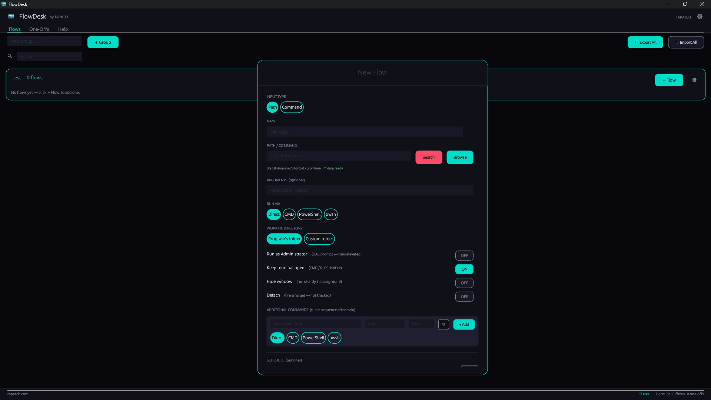

# 🚀 FlowDesk

**Launch and organize everything, perfectly.**

> Built because no launcher did everything without compromise. FlowDesk does.



---

## Download

**[⬇ Download FlowDesk v1.0.0](https://tapatch.com/tools/flowdesk)** — Free for personal use · Windows 10/11 · x64

| | |
|---|---|
| Version | 1.0.0 |
| Platform | Windows 10/11 |
| Architecture | x64 |
| Size | ~5 MB |
| Price | Free |
| License | Personal use |

---

## What it does

FlowDesk is a unified task launcher and scheduler. Pin apps, scripts, folders, and URLs, organise them into categories, and schedule anything to run at a time or interval — with optional UAC elevation. Import and export your setup as JSON. Everything in one tight interface, nothing in the system tray you didn't ask for.

---

## Features

**🚀 App launcher**
Pin apps, scripts, folders, and URLs for one-click launch. Search through everything instantly as your list grows.

**🕐 Scheduler**
Schedule any item to run at a specific time, on an interval, or at startup. Set it once and forget it.

**🛡️ UAC elevation**
Run any launcher item as administrator with built-in elevation support.

**📁 Categories**
Organise launchers into labelled groups. Collapse, reorder, and customise to match how you actually work.

**📦 Import / Export**
Save your entire launcher setup to a JSON file. Restore it on a new machine or share it with your team.

**🔍 App search**
Search installed apps directly from FlowDesk without opening the Start menu or typing in Explorer.

---

## Limitations

- Scheduled tasks only run while FlowDesk is open. For persistent background scheduling, add FlowDesk itself to Windows startup.

---

## Changelog

### v1.0.0 — Initial release
- App, script, folder, and URL launcher entries
- Time-based and interval scheduling with startup support
- UAC elevation per launcher item
- Category grouping with collapse/expand
- JSON import and export for full profile backup
- Integrated installed-app search

---

## Security

VirusTotal scan: **3 / 72 engines** — [View report](https://www.virustotal.com/gui/file/f7c4367f4ea59a7b988f1ce5184a0bc11dbe47873b8a2f28ed121ea7840f6ff2/detection)

The 3 flags are ML heuristics from SecureAge, Microsoft, and Symantec on an unsigned Rust binary. No major AV vendors flagged it.

**SHA-256**
```
f7c4367f4ea59a7b988f1ce5184a0bc11dbe47873b8a2f28ed121ea7840f6ff2
```

---

## Built with

Rust · egui · eframe · serde · rfd

---

## License

Free for personal use. See [Terms](https://tapatch.com/terms/software) for full license.

---

**[tapatch.com](https://tapatch.com)** — Small tools, serious quality. Built solo, shipped with care.
